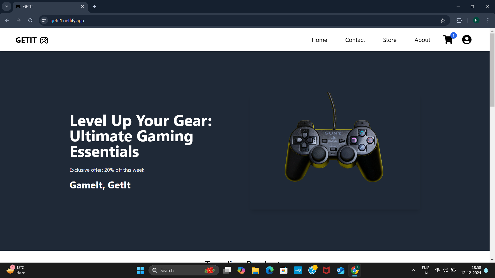

# GETIT (Frontend)

E-Commerce Website for Gaming Accessories

This project is a full-stack e-commerce website where users can buy gaming accessories. The application provides a seamless shopping experience with a modern user interface and secure backend functionality.


## Features

1. User Authentication:

    Signup and login functionality.

    JWT-based authentication using Simple JWT.

2. Frontend:

    Built using React.

    Styled with Tailwind CSS.

    Notifications and alerts implemented with React Toastify.

3. Backend:

    Developed using Django REST Framework (DRF).

    API endpoints for products, cart, orders, and user management.

    Payment Integration:

    Integrated Razorpay for secure payments.

4. Test the payment with the following test card:

    Card Number: 5267 3181 8797 5449

    Expiry Date: 08/30

    CVV: 123

    Select "Success" to simulate a successful payment.

5. Core Functionalities:

    View product catalog.

    Add products to cart.

    Checkout page with Razorpay payment integration.

   U ser profile page to update personal information and view  order history.

6. State Management:

    Implemented using React Context API.
    
## Tech Stack

1. Frontend:

   Framework: React

   Styling: Tailwind CSS

   Notifications: React Toastify

   Deployment: Netlify

2. Backend:

   Framework: Django REST Framework (DRF)

   Authentication: Simple JWT

   Payment Gateway: Razorpay

   Deployment: Render
# Installation

## Frontend (React)

Navigate to Frontend:
```bash
cd frontend
```

Install Dependencies:
```bash
npm install
```

Start the Development Server:
```bash
npm start
```

Environment Variables: Add the backend API URL in an .env file:
```arduino
REACT_APP_API_URL=http://localhost:8000
```

## User Authentication:

This project implements a secure user authentication system using JWT (JSON Web Token) powered by Simple JWT from Django Rest Framework (DRF). Users can sign up and log in to the platform, and their session tokens are stored securely. These tokens are used to verify and authorize requests, ensuring only authenticated users can access certain features like adding items to the cart, checking out, and viewing or updating their profile.

The authentication flow ensures a seamless and secure experience, integrating with React Context for state management to maintain the user's login state across the application. Notifications during login, logout, or authentication errors are managed using React Toastify for instant feedback.

## Payment Testing

To test the payment gateway integration:

1. Add products to the cart and proceed to checkout.
2. Use the following Razorpay test card details:
   Card Number: 5267 3181 8797 5449
   Expiry Date: 08/30
   CVV: 123
3. Click on Success to simulate a successful payment.

## Screenshots

### Home Page


### Products 


### Single Product Page


### Cart Page


### Checkout Page


### Profile Page


### Payment Success Page


## Demo

Live : https://getit1.netlify.app


## Backend

Backend : https://github.com/Ronit1808/GETIT-Backend
## License

[MIT](https://choosealicense.com/licenses/mit/)

